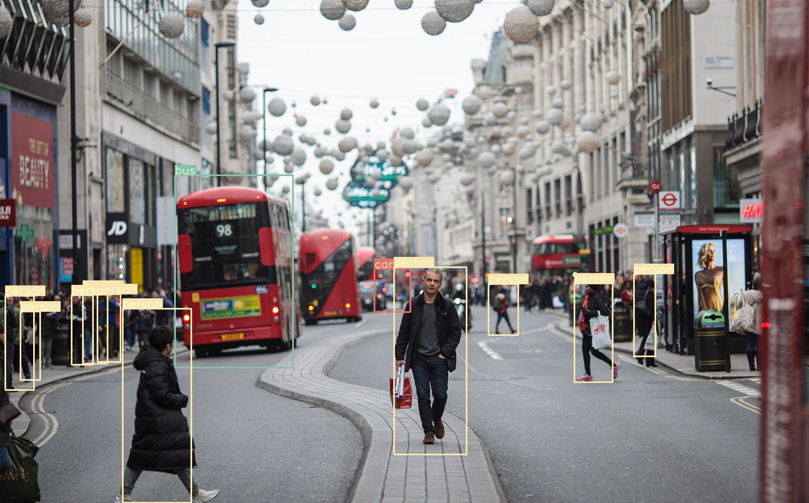
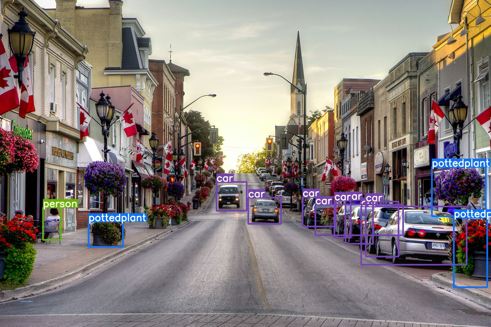
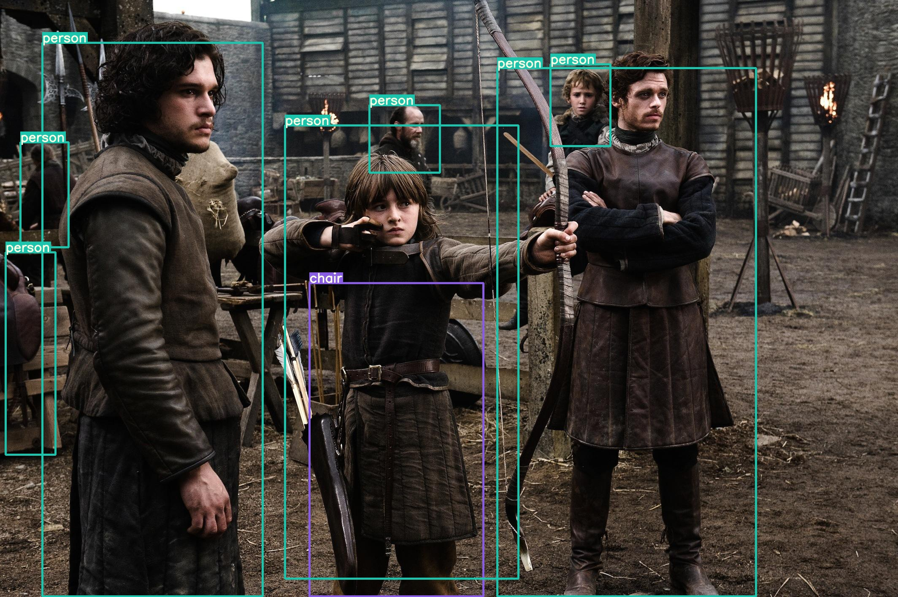
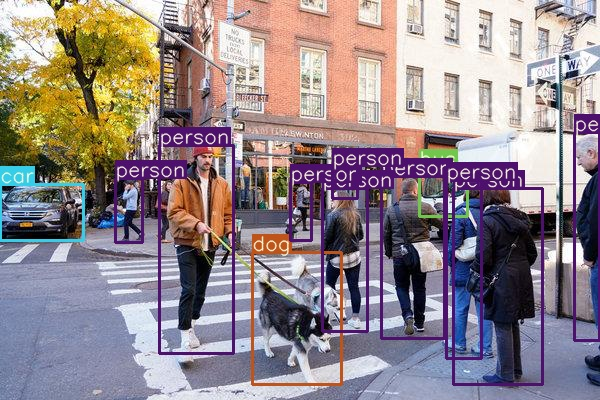
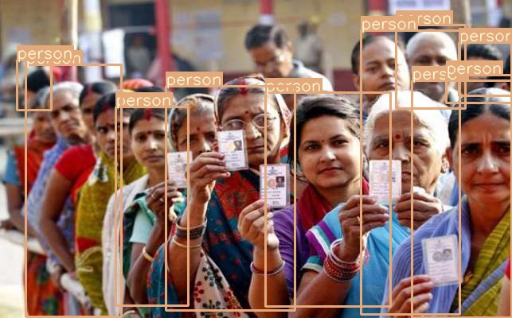

### Faster-RCNN
Faster-RCNN PyTorch Implementation.



### Description

This repository is a product when I started learning Faster-RCNN. I investigated many nice implementations based on PyTorch, which helped me to understand this algorithm. Then I rewrite and reorganize their codes to form this repo. It contains training and inference code of YOLOv3 in PyTorch. It is self-contained on mainstream platform and it supports custom data trianing and multi GPUs as well. The paper can be found [here](https://arxiv.org/abs/1506.01497). 

Followed their codes, helped me go through the Faster-RCNN algorithm. Then I reconstructed & rewrited them and made some modifications to try to reimplement it. It is recommended to read their codes to see the specific implementation steps and logic. Also you can just go to the [Dev](/Dev) for more details.

#### Please upgrade your torch and torchvison to the latest version. 


### Requirements

  - python >= 3.6
  - numpy
  - torch >= 1.1.0 (tensorboard)
  - torchvision >= 0.3 (nms, roi_pool, roi_align)
  - opencv
  - CUDA(optional)


### Training
```
$python train.py --net vgg16 --epochs 20 --bs 1
```
* **Custom dataset** The original dataset implementation is quite painful. Here I use [ChainerCV](https://github.com/chainer/chainercv) for dataset, which is quite pytorch style. It's easy to applied to your own data.


### Inference

See detect.py

   
   
    


License
----
[](https://github.com/996icu/996.ICU/blob/master/LICENSE)


   
## Notice

* Please note, this is a research project! It should not be used as a definitive guide on object detection. Many engineering features have not been implemented. The demo should be considered for research and entertainment value only.
* The used images were from web, please contact me if they infringe your digital copyright.
* For the limatation of computing resource, I'll update the training result gradually.

## Reference
* rbgirshick/py-faster-rcnn: https://github.com/rbgirshick/py-faster-rcnn
* chainercv/faster_rcnn: https://github.com/chainer/chainercv/tree/master/chainercv/links/model/faster_rcnn
* jwyang/faster-rcnn.pytorch: https://github.com/jwyang/faster-rcnn.pytorch/tree/master
* chenyuntc/simple-faster-rcnn-pytorch: https://github.com/chenyuntc/simple-faster-rcnn-pytorch
* ruotianluo/pytorch-faster-rcnn: https://github.com/ruotianluo/pytorch-faster-rcnn 
